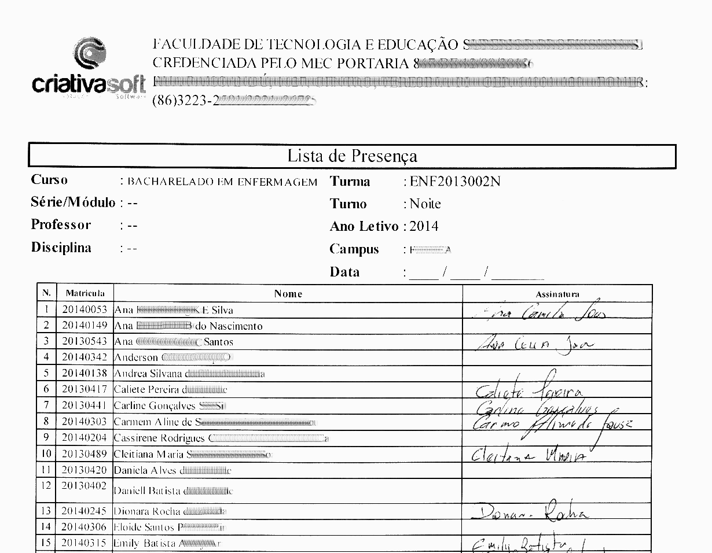
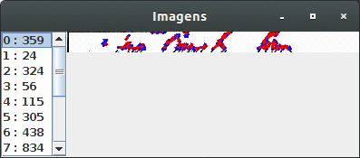

# TableAnalysisBoofCV

**Problem description**: Identify the signatures at a frequency record in order to generate lack registration for students. It is not in the signature validation scope itself.

**Descrição do Problema**:  Identificar a existência ou não das assinaturas em uma ficha de frequência afim de gerar registro de falta para os alunos. Não está no escopo a validação da assinatura em si.

**Input:**  

**Output:**  
